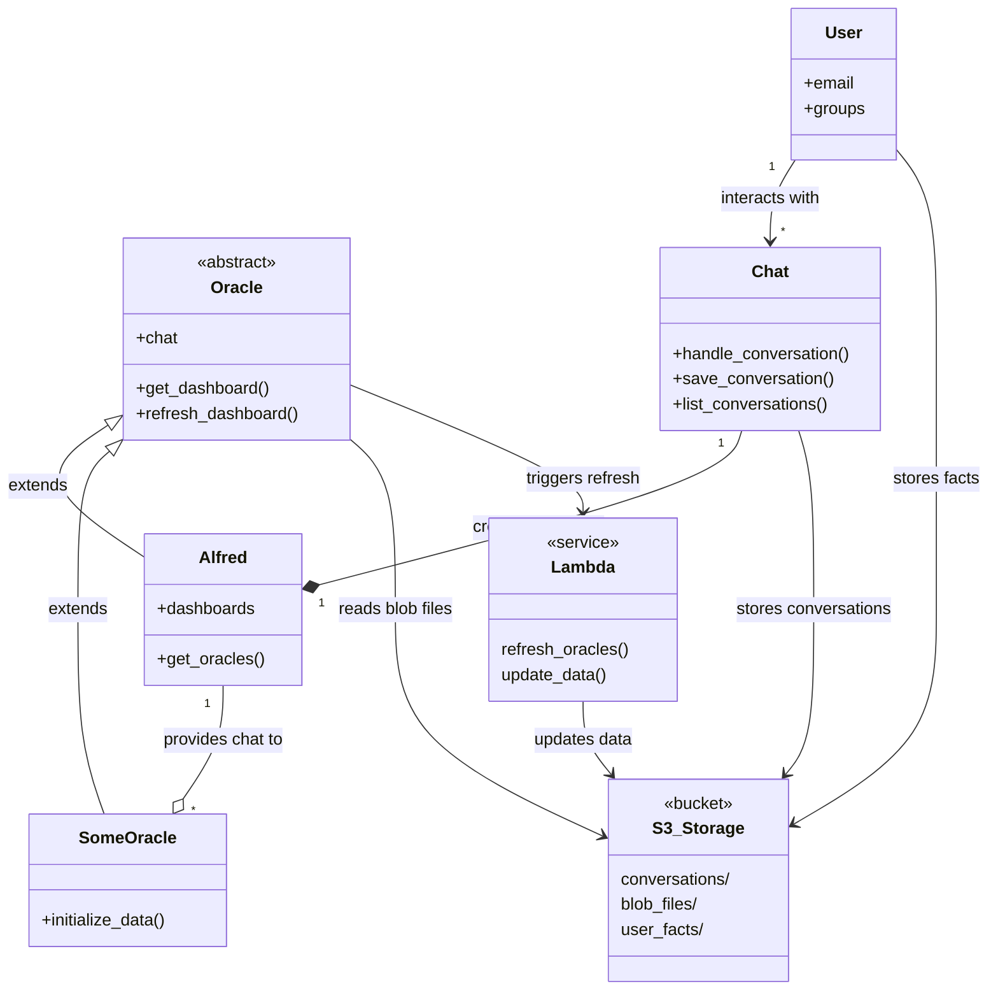

# Alfred - Zero Trust LLM Chat for Internal Usage 

alfred.apprenticefs.net

## What is Alfred?
A Flask/React app that hosts multiple dashboards with specialized oracles (Devision, Lucius, etc). Uses Claude for chat and context management while users navigate between views.

## Third Party Services
- Anthropic API - LLM service 
- AWS ECS, Lambda, S3 (api, analysis, storage)
- Cloudflare - Zero Trust reverse-proxy service and user access control

## Running Locally
1. Clone this repo
2. Install docker, make, and python/pip
3. Rename .env.tpl to .env and add your keys (ping @sec)
4. Run:
```bash
make build && make up
```

## Architecture

### Class Structure


Alfred manages the central Chat instance that gets passed to other oracles. Each oracle handles its own data but shares the chat context. Alfred's data is the user facts extracted from the conversations of the logged in user, he creates his own data source as conversations are saved. 

## API Flow Examples

Start chat:
```python
POST /api/chat
{
    "dashboard_id": "alfred",
    "prompt": "initial message",
    "messages": []
}
```

Switch dashboard:
```python
POST /api/chat
{
    "dashboard_id": "specialized_dashboard", 
    "prompt": "Tell me about this view",
    "conversation_id": "conv-123",
    "messages": [...]
}
```

File upload:
```python
POST /api/chat
{
    "action": "get_upload_url",
    "file_extension": ".txt",
    "dashboard_id": "alfred"  
}
```

Save conversation:
```python
POST /api/chat
{
    "action": "save",
    "dashboard_id": "alfred",
    "conversation_id": "conv-123",
    "messages": [...]
}
```

## Creating New Oracles

### 1. Backend Class
```python
from app.server.models import Oracle

class NewOracle(Oracle):
    def __init__(self, chat):
        super().__init__(
            blob_filename="new_oracle/data.json",
            chat=chat
        )
        self.lambda_function = os.getenv("NEW_ORACLE_LAMBDA")
        self.dashboard_context = "What this oracle does"
        
    def initialize_data(self):
        data = self.get_blob_data()
        self.data = {
            "apps": data.get("apps", {}),
            "stats": self.calculate_stats(data)
        }

    def get_dashboard_summary(self):
        return {
            "total_items": len(self.data["apps"]),
            "stats": self.data["stats"]
        }
```

### 2. Register in API
```python
from app.server.services.new_oracle import NewOracle

new_oracle_instance = NewOracle(chat=chat_instance)

class DashResource(Resource):
    @staticmethod
    def get_instance_by_dashboard_id(dashboard_id):
        if dashboard_id == "new_oracle":
            return new_oracle_instance
        # ... other oracles
```

### 3. Frontend Component
```jsx
// NewOracleDashboard.jsx
const NewOracleDashboard = ({ dashboardData, isLoading }) => {
    return (
        <div className="dashboard-content">
            {/* Your dashboard UI */}
        </div>
    );
};

// Add to Dashboard.jsx
function Dashboard({ dashboard }) {
    return (
        <div className="dashboard">
            {dashboard === 'new_oracle' && (
                <NewOracleDashboard 
                    dashboardData={dashboardData}
                    isLoading={refreshing}
                />
            )}
        </div>
    );
}
```

### 4. Lambda Handler
```python
def lambda_handler(event, context):
    s3 = boto3.client('s3')
    data = {
        "apps": {},  # Your data 
        "stats": {}  # Your stats
    }
    
    s3.put_object(
        Bucket=os.environ['DATA_BUCKET'],
        Key='new_oracle/data.json',
        Body=json.dumps(data)
    )
    
    return {
        'statusCode': 200,
        'body': 'Updated'
    }
```

### 5. Data Structure
```json
{
    "apps": {
        "item1": {
            "id": "item1",
            "type": "type1",
            "status": "active",
            "metadata": {},
            "configs": []
        }
    },
    "stats": {
        "total": 0,
        "by_type": {},
        "by_status": {}
    }
}
```

### 6. Env Var
```bash
NEW_ORACLE_LAMBDA=your-lambda-arn
```

### 7. Tests
```python
def test_new_oracle():
    # Test dashboard load
    response = session.get(f"{BASE_URL}/dash?dashboard_id=new_oracle")
    assert response.status_code == 200
    
    # Test chat
    chat_response = session.post("/api/chat", json={
        "dashboard_id": "new_oracle",
        "prompt": "what's this?",
        "conversation_id": "test-conv",
        "messages": []
    })
    assert chat_response.status_code == 200
```

## Optional: Embeddings Setup
If you need semantic search:

```python
def generate_embeddings(data):
    client = OpenAI()
    embeddings_data = {
        "texts": [],
        "embeddings": [],
        "metadata": []
    }
    
    for item in data:
        response = client.embeddings.create(
            model="text-embedding-ada-002",
            input=item["description"]
        )
        embeddings_data["texts"].append(item["description"])
        embeddings_data["embeddings"].append(response.data[0].embedding)
        embeddings_data["metadata"].append({
            "id": item["id"],
            "type": item["type"]
        })
    
    return embeddings_data
```

## Dev Guidelines
1. Always handle errors and log stuff
2. Use type hints
3. Keep dashboard contexts clear
4. Load big datasets incrementally
5. Update docs as you go

## To Do
- Add decision-making abilities
- Read from database
- Lambda invoke and JSON query toolset