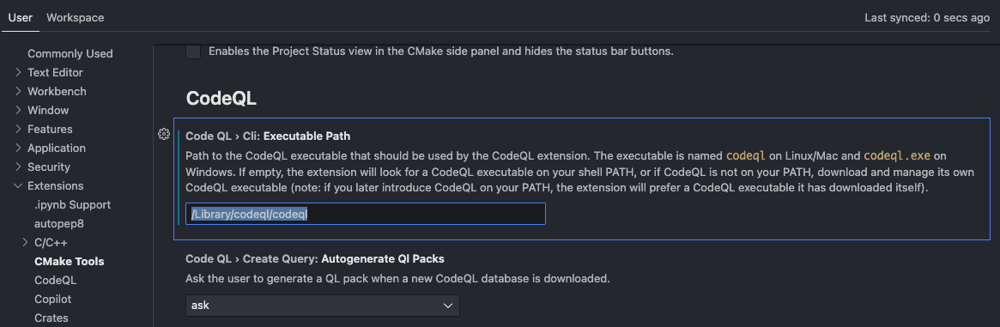

# Installing CodeQL

You can download CodeQL from the [releases page](https://github.com/github/codeql-action/releases).

## Extraction for macOS Users

For macOS "Catalina", "Big Sur", "Monterey", or "Ventura" users, you need to run the following commands in the Terminal. Replace `${extraction-root}` with the path to the directory where you want to extract the CodeQL CLI zip archive:

```bash
mv ~/Downloads/codeql\*.zip ${extraction-root}
cd ${extraction-root}
/usr/bin/xattr -c codeql\*.zip
unzip codeql\*.zip
```

## Personal Preference

For instance, you could set extraction-root to `/Library/codeql`. 

If you're using zsh, you can add the following path to your `.zshrc` file:
NOTE: you will have issues if with the codeql vscode extension if you use alias.

```bash
export PATH="/Library/codeql:$PATH"
nano ~/.zshrc
```

To get the plugin to work you will need to go to code > settings > Extensions > codeql to and add the path
Docker must also be runnign


## Testing

You can test the installation with the following command:

```bash
codeql resolve qlpacks
```

## Writing Queries
Here's an example query:

```codeql
 import javascript
 import Express
 
 from Express::RouteSetup setup
 where setup.getMethodName() in ["get", "post", "put", "delete"]
 select setup, "Method: " + setup.getMethodName() + ", Path: " + setup.getPath()
 ```

 1. start with importing the language of the code. You can only make queries with one language at a time.
 2. set your variables with the from statement. Here I'm setting a variable with the type Express::RouteSetup. You can separate variables with commas.
 3. write your query with the where. Here I'm requesting all RouteSetup objects that have the method names in the list.
 4. Next I am selecting my output with select, where I will list all the setup items from the query and a second coloum with the method contatinated to the path.
 5. This must be done becase of column limitations in codeql which only allow even number of columns

 The following resource is good to learn about different classes in codeql:
 https://codeql.github.com/codeql-standard-libraries/javascript/

the github repo has additional query examples:
https://github.com/github/codeql/tree/main/javascript/ql/src/Security

# Using the CLI
I use the CLI because the plugin can be hit or miss.

unless you copy monorepo to the working directory or you are in the monorepo folder you will need to put the full path to a git repo with no trailing /.
```bash
codeql database create --language=javascript --source-root=/Users/username/directory/to/monorepo name_of_database
```
running this command will create the database folder in the working directory so becareful not to add this folder to your repo

to install the needed libraries run
```bash
codeql pack install
```
Then to run all queries in the codeql/javascript folder run
```bash
codeql database analyze --format=sarif-latest --output=test.sarif monorepo
```
formats include: csv, sarif-latest, sarifv1, sarifv2, sarifv2.1.0, graphtext, dot, dgml, lgtm

# Pentest scope:

Running CodeQL Analysis

    Clone Your Repository:
        Clone the repository you want to analyze:
```bash
    git clone https://github.com/your-username/your-repo.git
```
Navigate into the repository:
```bash
    cd your-repo
```
Create a CodeQL Database:

    For each branch you want to analyze, checkout to the branch:
```bash
    git checkout branch-name
```
Create a CodeQL database for the branch:

```bash

    codeql database create ql-db-branch-name --language=java

    Replace java with the programming language of your project as needed.
```
Run CodeQL Queries:

    Execute the analysis using the standard queries or your custom queries:
```bash

        codeql database analyze ql-db-branch-name /path/to/queries --format=csv --output=results-branch-name.csv

        Repeat the steps for each branch you want to analyze.
```
Comparing CodeQL Outputs

    Install a Diff Tool:
        Install a diff tool if not already installed. You can use tools like diff, meld, or any other graphical or command-line tool.

    Compare Analysis Results:
        Use the diff tool to compare the output CSV files from two different branches:

```bash

diff results-branch1.csv results-branch2.csv > diff-output.txt
```

Review the diff-output.txt to see the differences in the analysis results.


